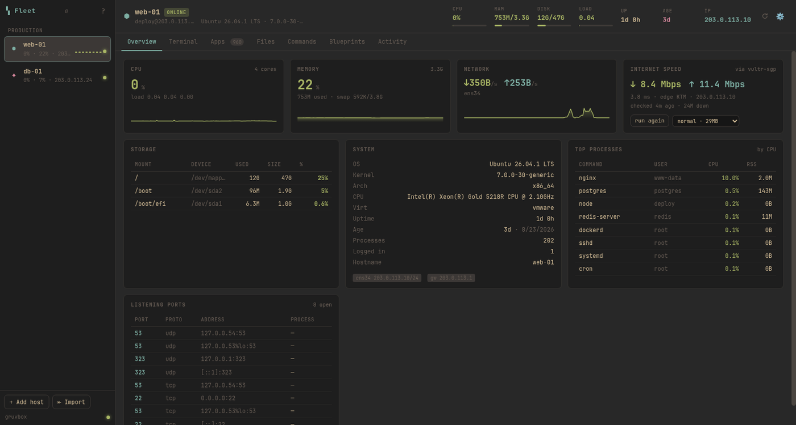

# Fleet

A VPS manager for [Omarchy](https://omarchy.org/). Your servers in one window:
live metrics, real terminals, a file manager that copies between hosts, an
inventory you can search across every machine, and a way to make one box look
like another.



Zero Python dependencies — HTTP, WebSockets and PTYs are all standard library.
A tool for managing *other* machines should not break when this one updates.

## Install

As an Omarchy plugin — this installs the app *and* the bar widget:

```sh
omarchy plugin add https://github.com/niraj-envision/Fleet.git --enable
```

Or standalone, without the bar widget:

```sh
git clone https://github.com/niraj-envision/Fleet.git
cd Fleet
./install.sh
```

Needs `python3` (3.9+), `ssh`, a browser, and `secret-tool` backed by an
unlocked Secret Service keyring. `openvpn` or `wireguard-tools` is needed only if your
servers sit behind a VPN. The installer offers to add the Hyprland keybinding
and window rule; `./install.sh --uninstall` removes the app and its exact
managed Hyprland blocks while leaving hosts, state and credentials alone.

Then `fleet`, or `SUPER + SHIFT + V`.

    fleet            # start it (or focus the window if it is already running)
    fleet stop       # stop the server
    fleet url        # print the local URL
    fleet --version  # print the installed release
    SUPER + SHIFT + V

## What it does

**Connections are already open.** Every host gets an SSH `ControlMaster` at
startup, so the fleet is live before the window finishes painting. After the
first handshake a remote command costs ~40ms instead of a full reconnect —
that is what makes metrics, terminals and scans feel instant.

**Sidebar.** Icon, name, live CPU/RAM sparkline and status dot per host,
grouped by your own labels. `Alt+1..9` jumps between hosts.

**Overview.** CPU, memory, network and disk with history; OS, kernel, arch,
virtualisation, uptime, IPs, gateway, temperature; top processes; open ports.

**Age** is how long the machine has existed, taken from the root filesystem's
creation time — a different question from uptime, which is time since the last
reboot. Both are shown.

**Internet speed** runs *on the server*, using nothing but `curl`, so nothing
gets installed on your box to answer a dashboard question. It does not trust a
single endpoint: measured on a real host here, Cloudflare's speed endpoint
delivered 0.7 Mbps while Vultr Singapore delivered 7 Mbps over the same link.
Fleet samples 1MB from four geographically spread sources, then measures
properly against whichever answered fastest — the same thing a real speed test
does when it picks a server. The card shows the last result and how long ago it
was taken; the preset selector states exactly how much data each run transfers
(14 / 29 / 104 MB) so a test never surprises a metered link.

**Terminal.** Real PTYs over the connection that is already open. Multiple
tabs per host, full scrollback, and sessions survive closing the window —
reopen Fleet and your shells are where you left them.

**Apps.** Packages, services, containers, images, open ports and language
runtimes, scanned over SSH. Works across apt / dnf / yum / pacman / apk /
zypper. Install, remove, upgrade, restart services — each runs in a visible
terminal, never silently in the background.

**Files.** A two-pane-less file manager that treats **this computer as just
another location**, so one copy/paste model covers every direction: VPS to
VPS, VPS to here, here to VPS, and within a single host.

- Browse with breadcrumbs, sorting, hidden-file toggle, free space, and
  `Backspace` to go up. Directories always sort first.
- **Copy / cut on one host, switch host, paste** -- the clipboard survives the
  switch, which is the whole point.
- Drag files onto the listing to upload, with real progress. Download files
  directly; download a directory and it arrives as `.tar.gz`.
- Edit text files in place; the previous contents are kept as `.fleet.bak`.
- New folder, rename, chmod, delete, and "shell here" to open a terminal
  already `cd`-ed into the directory you are looking at.

Transfers stream through a single `tar` pipe rather than `scp`, which is what
lets one implementation handle all four directions, preserve permissions and
directory trees, and still report byte-accurate progress you can cancel.
A copy within one host skips the round trip and uses `cp -a`.

File ages are measured against **the host's own clock**, so a server whose
time differs from this machine does not show files modified in the future.

**Commands.** The commands you actually use on each host, mined from its shell
history and ranked by frequency, plus snippets shared across every host.
Run on one host or fan out across many at once.

**Blueprints.** Capture what a host *has* — explicitly-installed packages,
docker images, compose projects, enabled services, global npm/pip/cargo
packages — then diff that against another host and generate a script to close
the gap. The spec records intent (`install nginx`), not mechanism, so a
blueprint captured on Debian installs through `pacman` on Arch. You always see
the diff and the full script before anything runs, and it runs in a terminal
you can watch and Ctrl-C.

**Search everything — `Ctrl+K`.** One box over every indexed object on every
host: packages, services, ports, containers, images, runtimes, hosts and saved
commands. Typing `>` turns it into a command runner instead.

**Native Omarchy themes.** Fleet consumes Omarchy's resolved semantic palette,
not a copied list of theme names or colors. `omarchy theme set ...` repaints the
open app and every embedded terminal within a couple of seconds. Semantic
accent, selection, foreground/background shades and light/dark mode come from
`omarchy-theme-color`, so stock themes, user themes, legacy ANSI themes and
future themes all use the same compatibility layer as Omarchy itself. Fleet's
test suite resolves every installed theme without changing the active theme.

## Keys

Single letters, Omarchy style. They work whenever you are not typing and not
focused inside a terminal — a shell has to receive every keystroke, so the
`alt` forms are the way out of one. Press `?` in the app for this list.

| | |
|---|---|
| `1`–`9` | Jump to host |
| `o` `t` `f` `a` `c` `b` `v` | Overview, Terminal, Files, Apps, Commands, Blueprints, Activity |
| `/` | Search everything across all hosts |
| `?` | Keyboard shortcuts |
| `n` | New shell on this host |
| `r` | Reconnect this host |
| `s` | Run the speed test (Overview) |
| `V` | VPN tunnels |
| `R` | Rescan this host (Apps) |
| `i` | Start typing a command (Commands) |
| `esc` | Close a dialog, or leave a text field |

**In Files:** `j`/`k` move, `h`/`l` parent/open, `g`/`G` first/last,
`x` or `space` select, `A` select all, `y` copy, `m` cut, `p` paste here,
`d` download, `u` upload, `N` new folder, `.` toggle hidden.

**From inside a terminal:** `ctrl+k` search, `alt+o`…`alt+v` switch tab,
`alt+1`…`alt+9` jump host, `ctrl+shift+t` new shell.

**VPN.** Some fleets are only reachable from inside a tunnel, so the tunnel is
part of connecting rather than something you are expected to arrange first. A
host names a profile — *route through: office* — and opening that host brings
the tunnel up before ssh runs. If it cannot, the error you see is the VPN's own
words, not ssh's eventual "no route to host".

Both clients Fleet drives are the real ones: **OpenVPN**, given a `.ovpn`, and
**WireGuard**, given a `.conf`. Drop the file in (or paste it) and Fleet reads
it back to you before saving — where it connects, whether it wants a login,
which certificates it expects to find beside it, and **which directives run a
program as root** when the tunnel comes up. A provider's config often has one,
legitimately, to set DNS; you should still see it first.

**Server override.** A provider usually gives you one `.ovpn` and a web page
listing thirty servers you may use. Rather than make you hand-edit a file full
of inline certificates, a profile can override the endpoint — host, port and
`udp`/`tcp` — while keeping everything else the config says. Your import is
never modified; Fleet writes a separate copy with the `remote` line rewritten
and runs that, and the editor shows you the exact substitution before you
save:

    proto udp                        →  proto tcp-client
    remote vpn.acme-corp.com 1194    →  remote sg1.acme-corp.com 443 tcp

The card then reports where it will actually connect, tagged `override`, with
the config's own value on hover. Clearing the fields deletes the generated copy
and goes straight back to the import. Override values are validated the way
hostnames bound for `ssh_config` are — a newline in one would be a directive in
a file a root process executes, so nothing but the characters an address can
contain gets through.

OpenVPN runs with a management socket in Fleet's own directory, so connection
state, throughput and the credential prompts all arrive on a channel Fleet
owns. The username and password are answered there — never written to a file,
never on a command line, never in `ps` — which is the same shape as the
`SSH_ASKPASS` path everything else here uses. WireGuard's status comes from
`/sys` and `ip` rather than `wg show`, because those need no privilege and say
the same thing, so watching a live tunnel never prompts for anything.

The sidebar shows what is up and what is moving through it. A host header says
`⇅ office` in green only when the routing table actually sends that host down
the tunnel — up and *carrying this host* are different questions, and the
second one is the one you care about at 2am.

**Getting root is the honest part.** A tunnel means a tun device and a routing
table edit; Fleet does not run as root and does not ask to. Every connect and
disconnect goes through `pkexec` — the desktop password prompt — or `sudo -n`
if you have already configured a rule. Fleet will not install that rule for
you, and the panel says why: an OpenVPN `up` script and a WireGuard `PostUp`
line both run as root, so a NOPASSWD rule for those two binaries is a NOPASSWD
rule for anything. Disconnecting OpenVPN asks the process to exit over its
management socket instead, so a normal up/down cycle costs one prompt, not two.

Tunnels are left up when you close the window, for the same reason the ssh
masters are: a route you may still be using should not disappear because a
window did.

## Authentication

All of it: ssh-agent, a specific private key (with or without a passphrase),
passwords, and any of those behind a `ProxyJump` bastion. Passwords and
passphrases go to your keyring (gnome-keyring here) and are handed to `ssh`
through `SSH_ASKPASS` — never on a command line, never written to the ssh
config. Password hosts get a one-click "install a key and switch to key auth".

## Where things live

    ~/.config/fleet/hosts.json      your hosts — plain JSON, safe to hand-edit
    ~/.config/fleet/settings.json   poll intervals, font size
    ~/.config/fleet/vpns.json       your VPN profiles
    ~/.config/fleet/vpn/            the imported .ovpn / .conf files, mode 600
    ~/.config/fleet/vpn/effective/  generated when a profile overrides its server
    ~/.local/state/fleet/fleet.db   inventory cache, search index, history
    ~/.local/state/fleet/ssh_config generated; edits are overwritten
    $XDG_RUNTIME_DIR/fleet-vpn/     OpenVPN management sockets, while connected
    ~/.local/share/fleet/           the app itself

## Removal

```sh
omarchy plugin remove io.github.niraj-envision.fleet      # if installed as a plugin
./install.sh --uninstall             # removes the app, launcher, desktop entry
```

Removal asks for confirmation and transactionally removes the application plus
Fleet's exact managed Hyprland blocks. It deliberately leaves your own data
alone: hosts in `~/.config/fleet`, state in `~/.local/state/fleet`, VPN profiles,
and credentials in your keyring.

## What it needs, and what it touches

**Dependencies.** `python3` (3.9+), `ssh`, and a Chromium-family browser for
the window. `secret-tool` is required for credentials, and `curl` on
the *remote* host for the speed test. `openvpn` and/or `wireguard-tools` only
if you use the VPN panel — Fleet drives whichever client your provider needs
rather than shipping one, and says so plainly when neither is installed. No
Python packages, no npm install, no build step. `web/vendor/` carries xterm.js, vendored and MIT licensed — see
[web/vendor/NOTICE](web/vendor/NOTICE).

**On this machine** Fleet writes only under `~/.config/fleet`,
`~/.local/state/fleet` and its own install directory. The one thing it does
outside that is a VPN: bringing a tunnel up runs `openvpn` or `wg-quick` as
root through `pkexec`, which changes your routing table for as long as the
tunnel is up. Nothing happens without a profile you imported and a button you
pressed. It binds a loopback-only
port with a token regenerated each launch. Adding the plugin changes nothing
outside the plugin folder. `install.sh` is the only setup path that writes
elsewhere, and it asks before touching Hyprland. Every application and config
file is changed under one locked, descriptor-bound write-ahead transaction:
backups and the complete plan are fsynced before mutation, replacements are
atomic, concurrent edits are refused, failures roll back, and the next run
recovers a transaction interrupted by a crash or session kill.

**On your servers** Fleet does what you tell it to over SSH, which is the whole
point: run commands, install and remove packages, start and stop services,
transfer files, and apply blueprints. Package and service operations use `sudo`
**on the remote host**, never locally. A blueprint is uploaded to the target's
`/tmp` and run there — you see the generated script in full and approve it
before anything executes, and it runs in a terminal you can watch and Ctrl-C.

**Credentials** go to your keyring via `secret-tool` and reach `ssh` through
`SSH_ASKPASS`, so they never appear in `ps` output, in a command line, or in
the generated ssh config.

## Bar widget

Fleet ships an Omarchy bar widget (`io.github.niraj-envision.fleet`) showing how many of your
servers are reachable.

| | |
|---|---|
| `2/2` | all hosts online |
| urgent | a host is unreachable — the count tells you how many |
| warning | a disk is over 90% |
| `·` muted | Fleet is not running; click to start it |

Click opens a compact network-status panel with an explicit **Open full app**
button for launching the full application. Right-click sends the full status
as a notification, and middle-click forces a refresh. Hovering shows CPU,
memory and disk per host.
Settings (refresh interval, icon, and *only show when something is wrong* for
a quiet bar) are editable from the bar's own plugin settings.

The widget holds no state: it polls `fleet bar --json`, which reads the running
Fleet server. Nothing about your fleet lives in QML, and the widget costs one
cheap local command per interval.

## Security model

Fleet drives SSH connections to your servers, so its own surface matters.

- **Loopback only, token per launch.** The listener binds `127.0.0.1` and
  `::1`; every request carries a token regenerated at each start. Nothing on
  your network can reach it.
- **Same-origin WebSockets.** WebSockets are exempt from CORS, so the upgrade
  handshake rejects a mismatched `Origin` outright rather than relying on the
  token alone.
- **`Referrer-Policy: no-referrer`.** The token is in the page URL and
  terminals render clickable links; without this, following one would hand the
  token to an external site. Terminal links also open `noopener,noreferrer`.
- **ssh_config values are validated, not just quoted.** A value written there
  is a directive in a file ssh executes, so a newline in a hostname would
  inject `ProxyCommand` and run arbitrary code on *this* machine. Every value
  is checked against a strict charset and a bad host is refused at the API with
  a reason.
- **Credentials never touch a command line.** Passwords and passphrases reach
  `ssh` through `SSH_ASKPASS`, so they never appear in `ps` output or on disk.
  They live in Secret Service. Fleet fails closed when the keyring is absent
  or locked and never reads the reversible fallback file used by older releases.
- **Recursive delete is depth-guarded.** Any single-component absolute path
  (`/etc`, `/home`, `/var`), `/`, `~`, and anything containing `..` is refused
  before it reaches `rm -rf`.
- **Static files cannot escape the web root**, checked with `realpath` on the
  resolved target so a symlink cannot step outside it either.
- **State is 0700**, with the database, log, generated ssh_config and askpass
  helper individually 0600/0700.
- **Installer changes are crash-consistent.** Mutable leaves are opened with
  no-follow/nonblocking flags, verified as single-link user-owned regular files,
  size bounded, backed up durably, and replaced through their anchored parent
  descriptors. Special files and writable ancestors fail closed.
- **Local tools use fixed package paths.** QML and Python never delegate trusted
  setup, SSH, Secret Service, VPN, Hyprland, or Omarchy operations to an
  inherited `PATH`. Commands intentionally run on managed remote hosts still use
  that host's own environment.

## Operating it

    fleet            start, or focus the window if already running
    fleet stop       stop the server
    fleet test       run the regression suite against your real hosts
    fleet log [n]    tail the log
    fleet health     server status as JSON
    fleet url        print the local URL
    fleet --version  installed semantic version
    fleet --debug    verbose logging on the console, tracebacks in API errors

`fleet test` exercises the whole stack — validation, inventory, search, exec,
fan-out, uploads, downloads, VPS-to-VPS transfer, delete guards, terminals —
against the hosts you actually have, because the things most likely to break
(ssh quoting, transfer pipes, remote clocks, distro differences) do not show
up against a mock. It works under `/tmp/fleet-regress-<ts>` and asserts at the
end that nothing was left behind.

- **One instance only**, enforced with an advisory lock that the kernel
  releases if the process dies — so a crash never leaves a stale claim.
- **Logs** go to `~/.local/state/fleet/fleet.log`, rotated at 1MB with two
  backups. Errors in the UI are reported there too: the app runs in a detached
  window whose console nobody reads, so a frontend exception would otherwise
  vanish silently.
- **`GET /api/health`** reports uptime, host count, online count, open
  sessions, connected UIs and running transfers.
- **Idle behaviour.** With no UI connected, polling drops to once a minute:
  state stays warm without paying for it every few seconds.
- **Bounded everywhere.** At most 64 hosts, 8 concurrent connection attempts at
  startup, 12 concurrent metric probes, 64 request threads, 48 terminal
  sessions, 16 queued/running transfers, 128 paths per operation, and 5000
  entries per directory listing (with visible truncation). Metrics keep an hour,
  runs 500, events 300, and speed tests 20.
- **Shutdown** closes terminals and removes the runtime file, but deliberately
  leaves the ssh masters up — `ControlPersist` keeps them warm so the next
  launch reconnects instantly.

## Design notes

- **No pip dependencies.** HTTP, WebSockets and PTYs are all standard library.
  A tool for managing other machines should not break when this one updates.
- **Loopback only, token per launch.** Nothing on your network can reach it.
- **Theme comes from Omarchy.** `omarchy theme set ...` repaints Fleet live;
  it ships no theme-specific palette of its own. The small CSS palette is only
  a first-paint/emergency fallback before the live semantic colors arrive.

## Releases

Fleet uses Semantic Versioning. `VERSION` is the canonical app version,
`manifest.json` carries the matching Omarchy plugin version, and releases are
tagged `vMAJOR.MINOR.PATCH`. See [CHANGELOG.md](CHANGELOG.md).

## Omarchy integration

- `~/.config/hypr/bindings.lua` — `SUPER + SHIFT + V`
- `~/.config/hypr/hyprland.lua` — window rule pinning Fleet fully opaque
  (matched on window *title*: Chromium opens web apps in the existing browser
  session, which ignores `--class` and derives an unstable app-id from the URL)
- `~/.local/share/applications/Fleet.desktop` — app launcher entry

## License

MIT — see [LICENSE](LICENSE). Vendored xterm.js assets under `web/vendor/` are
MIT licensed by their own authors; see [web/vendor/NOTICE](web/vendor/NOTICE).
