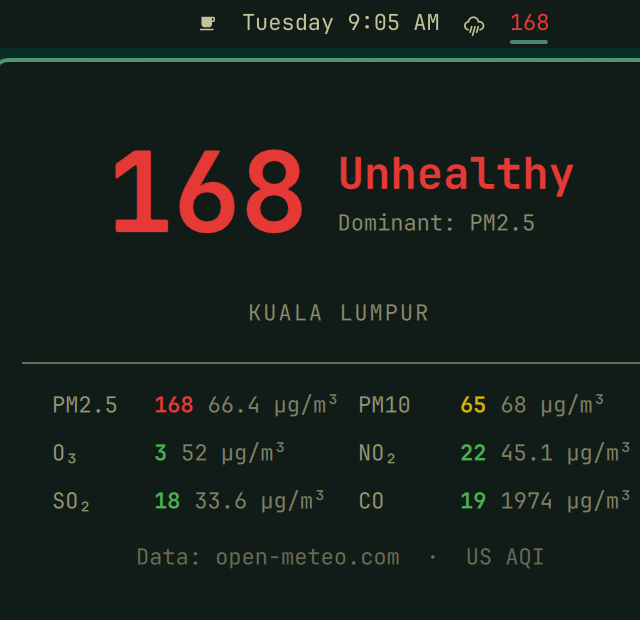

# Air Quality (Omarchy plugin)

A bar pill showing the current US AQI (Air Quality Index), color-coded by
EPA category, with a popup panel breaking it down by pollutant (PM2.5,
PM10, O₃, NO₂, SO₂, CO). Data comes from [Open-Meteo's free Air Quality
API](https://open-meteo.com/en/docs/air-quality-api) — no API key required.



## Install

```bash
omarchy plugin add https://github.com/selenophilezh/omarchy-plugin-aqi
```

Then add it to your bar:

```bash
omarchy bar put io.github.selenophilezh.aqi --section right
```

(or edit `~/.config/omarchy/shell.json` directly — see [plugin
docs](https://omarchyplugins.com/develop.html)).

## Usage

- **Left-click** the pill to open the breakdown panel.
- **Click the location name** in the panel to search and set a new
  location (autocomplete via Open-Meteo's geocoding API). Click the ✕ to
  clear back to IP-based auto-detect.
- **Middle-click** the pill to force an immediate refresh.
- **Right-click** the pill to send the current reading as a desktop
  notification.

## Location

This plugin reuses the same location as the built-in **Weather** plugin
(`~/.local/state/omarchy/settings/weather.json`), so if you've already set
a location for Weather, Air Quality picks it up automatically — no separate
setup needed. Changing the location from either plugin's popup updates both.
With no location configured, it falls back to IP-based auto-detect.

## Configuration

Available via the plugin's settings form (or directly in `shell.json`'s
bar layout entry for this widget):

| Key              | Type    | Default | Description                        |
|------------------|---------|---------|-------------------------------------|
| `refreshMinutes` | integer | `15`    | How often to poll for a new reading (5–180 min). |

## Removal

```bash
omarchy plugin remove io.github.selenophilezh.aqi
```

## Dependencies

`curl` and `jq` (both ship with Omarchy by default) — used for HTTP
requests and the right-click notification script. No API key or account
needed for Open-Meteo's free, non-commercial tier.

## Privilege / network notes

This plugin makes outbound HTTPS requests to `air-quality-api.open-meteo.com`,
`geocoding-api.open-meteo.com` (only while editing the location), and
`wttr.in` (only as an IP-geolocation fallback when no location is
configured). It reads (never writes directly to) Weather's location state
file, and writes location changes only through the official
`omarchy-weather-location` CLI. No elevated privileges are required.

## License

MIT — see [LICENSE](LICENSE).
